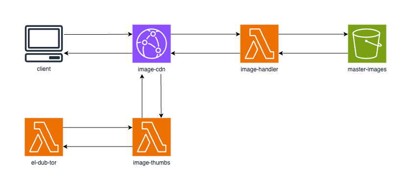

**[Serverless Image Handler](https://aws.amazon.com/solutions/implementations/serverless-image-handler/)** | **[🚧 Feature request](https://github.com/aws-solutions/serverless-image-handler/issues/new?assignees=&labels=enhancement&template=feature_request.md&title=)** | **[🐛 Bug Report](https://github.com/aws-solutions/serverless-image-handler/issues/new?assignees=&labels=bug&template=bug_report.md&title=)** | **[❓ General Question](https://github.com/aws-solutions/serverless-image-handler/issues/new?assignees=&labels=question&template=general_question.md&title=)**

**Note**: If you want to use the solution without building from source, navigate to [Solution Landing Page](https://aws.amazon.com/solutions/implementations/serverless-image-handler/).

## Table of Content

- [Solution Overview](#solution-overview)
- [Architecture Diagram](#architecture-diagram)
- [AWS CDK and Solutions Constructs](#aws-cdk-and-solutions-constructs)
- [Customizing the Solution](#customizing-the-solution)
  - [Prerequisites for Customization](#prerequisites-for-customization)
    - [1. Clone the repository](#1-clone-the-repository)
    - [2. Unit Test](#2-unit-test)
    - [3. Build & Deploy](#3-build-and-deploy)
- [Collection of operational metrics](#collection-of-operational-metrics)
- [External Contributors](#external-contributors)
- [License](#license)

# Solution Overview

The Serverless Image Handler solution helps to embed images on websites and mobile applications to drive user engagement. It uses [Sharp](https://sharp.pixelplumbing.com/en/stable/) to provide high-speed image processing without sacrificing image quality. To minimize costs of image optimization, manipulation, and processing, this solution automates version control and provides flexible storage and compute options for file reprocessing.

This solution automatically deploys and configures a serverless architecture optimized for dynamic image manipulation. Images can be rendered and returned spontaneously. For example, an image can be resized based on different screen sizes by adding code on a website that leverages this solution to resize the image before being sent to the screen using the image. It uses [Amazon CloudFront](https://aws.amazon.com/cloudfront) for global content delivery and [Amazon Simple Storage Service](https://aws.amazon.com/s3) (Amazon S3) for reliable and durable cloud storage.

For more information and a detailed deployment guide, visit the [Serverless Image Handler](https://aws.amazon.com/solutions/implementations/serverless-image-handler/) solution page.

# Architecture Diagram



The AWS CloudFormation template deploys an Amazon CloudFront distribution, Amazon API Gateway REST API, and an AWS Lambda function. Amazon CloudFront provides a caching layer to reduce the cost of image processing and the latency of subsequent image delivery. The Amazon API Gateway provides endpoint resources and triggers the AWS Lambda function. The AWS Lambda function retrieves the image from the customer's Amazon Simple Storage Service (Amazon S3) bucket and uses Sharp to return a modified version of the image to the API Gateway. Additionally, the solution generates a CloudFront domain name that provides cached access to the image handler API.

# AWS CDK and Solutions Constructs

[AWS Cloud Development Kit (AWS CDK)](https://aws.amazon.com/cdk/) and [AWS Solutions Constructs](https://aws.amazon.com/solutions/constructs/) make it easier to consistently create well-architected infrastructure applications. All AWS Solutions Constructs are reviewed by AWS and use best practices established by the AWS Well-Architected Framework. This solution uses the following AWS Solutions Constructs:

- [aws-cloudfront-s3](https://docs.aws.amazon.com/solutions/latest/constructs/aws-cloudfront-s3.html)
- [aws-cloudfront-apigateway-lambda](https://docs.aws.amazon.com/solutions/latest/constructs/aws-cloudfront-apigateway-lambda.html)

In addition to the AWS Solutions Constructs, the solution uses AWS CDK directly to create infrastructure resources.

# Customizing the Solution

## Prerequisites for Customization

- [AWS Command Line Interface](https://aws.amazon.com/cli/)
- Node.js 14.x

### 1. Clone the repository

```bash
git clone https://github.com/aws-solutions/serverless-image-handler.git
cd serverless-image-handler
export MAIN_DIRECTORY=$PWD
```


### 2. Unit Test

After making changes, run unit tests to make sure added customization passes the tests:

```bash
cd $MAIN_DIRECTORY/deployment
chmod +x run-unit-tests.sh && ./run-unit-tests.sh
```

### 3. Build and Deploy
```bash
cd $MAIN_DIRECTORY/source/constructs
npm run clean:install
overrideWarningsEnabled=false npx cdk bootstrap --profile <PROFILE_NAME>
overrideWarningsEnabled=false npx cdk deploy\
 --parameters DeployDemoUIParameter=Yes\
  --parameters SourceBucketsParameter=<MY_BUCKET>\
   --profile <PROFILE_NAME>
```

_Note:_
- **MY_BUCKET**: name of an existing bucket in your account
- **PROFILE_NAME**: name of an AWS CLI profile that has appropriate credentials for deploying in your preferred region

# Collection of operational metrics

This solution collects anonymous operational metrics to help AWS improve the quality and features of the solution. For more information, including how to disable this capability, please see the [implementation guide](https://docs.aws.amazon.com/solutions/latest/serverless-image-handler/op-metrics.html).

# External Contributors

- [@leviwilson](https://github.com/leviwilson) for [#117](https://github.com/aws-solutions/serverless-image-handler/pull/117)
- [@rpong](https://github.com/rpong) for [#130](https://github.com/aws-solutions/serverless-image-handler/pull/130)
- [@harriswong](https://github.com/harriswong) for [#138](https://github.com/aws-solutions/serverless-image-handler/pull/138)
- [@ganey](https://github.com/ganey) for [#139](https://github.com/aws-solutions/serverless-image-handler/pull/139)
- [@browniebroke](https://github.com/browniebroke) for [#151](https://github.com/aws-solutions/serverless-image-handler/pull/151), [#152](https://github.com/aws-solutions/serverless-image-handler/pull/152)
- [@john-shaffer](https://github.com/john-shaffer) for [#158](https://github.com/aws-solutions/serverless-image-handler/pull/158)
- [@toredash](https://github.com/toredash) for [#174](https://github.com/aws-solutions/serverless-image-handler/pull/174), [#195](https://github.com/aws-solutions/serverless-image-handler/pull/195)
- [@lith-imad](https://github.com/lith-imad) for [#194](https://github.com/aws-solutions/serverless-image-handler/pull/194)
- [@pch](https://github.com/pch) for [#227](https://github.com/aws-solutions/serverless-image-handler/pull/227)
- [@atrope](https://github.com/atrope) for [#201](https://github.com/aws-solutions/serverless-image-handler/pull/201), [#202](https://github.com/aws-solutions/serverless-image-handler/pull/202)
- [@bretto36](https://github.com/bretto36) for [#182](https://github.com/aws-solutions/serverless-image-handler/pull/182)
- [@makoncline](https://github.com/makoncline) for [#255](https://github.com/aws-solutions/serverless-image-handler/pull/255)
- [@frankenbubble](https://github.com/frankenbubble) for [#302](https://github.com/aws-solutions/serverless-image-handler/pull/302)
- [@guidev](https://github.com/guidev) for [#309](https://github.com/aws-solutions/serverless-image-handler/pull/309)
- [@njtmead](https://github.com/njtmead) for [#276](https://github.com/aws-solutions/serverless-image-handler/pull/276)
- [@StaymanHou](https://github.com/StaymanHou) for [#320](https://github.com/aws-solutions/serverless-image-handler/pull/320)
- [@alenpaulvarghese](https://github.com/alenpaulvarghese) for [#392](https://github.com/aws-solutions/serverless-image-handler/pull/392)

# License

Copyright Amazon.com, Inc. or its affiliates. All Rights Reserved.   
SPDX-License-Identifier: Apache-2.0