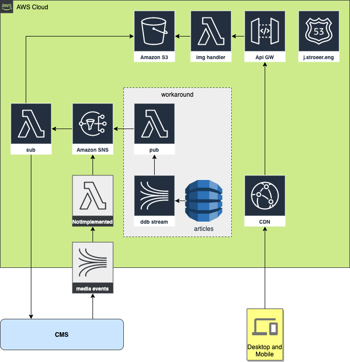

# Stroeer serverless image handler

This is a customized variant of the [AWS Serverless Image Handler].
Its **code** is open source and can be found by following the _forked from_ 
link above or otherwise [on GitHub][AWS Serverless Image Handler Repository].

Under the hood it uses the [sharp image processing library][sharp].

It is recommended to have a look at the [output options][output options], 
[resize operations][resize operations] and [image operations][image operations].

## Architecture



* `pub` and `sub` lambda are described [here][peruggia]. Their task is to publish
  the master images into the S3 bucket
* As for the image delivery, we're using CloudFront CDN as an entrypoint
* Its origin is an API Gateway
* Which then calls an AWS Lambda who is doing the actual work (image serving and manipulation).

### Feature: AUTO WEBP

The CDN is configured to respect the value of the `Accept` HTTP header. Given
there are 2 different browsers, one supports `webp`, one does not:

```shell
$ curl -v 'https://images.t-online.de/4k_hdr.jpg' \
        --header 'Accept: image/webp'
...
< HTTP/2 200
< content-type: image/webp
...
```

```shell
$ curl -v 'https://images.t-online.de/4k_hdr.jpg'
...
< HTTP/2 200
< content-type: image/jpeg
...
```

### (custom/experimental) Feature: Caching, Cache headers

#### Cache-Control

By default, every item has a `Cache-Control: public, max-age=31536000, immutable`. Images are immutable 
within the CMS, so there is a `immutable` flag at the moment.
If the image has an expiry date in the CMS, there should be a `Expires` header present and the
`Cache-Control` will be reduced accordingly.

After content has expired, a S3 lifecycle rule should automatically delete the master image from
the bucket.

A sample response could look like this:

```shell
$ curl -v https://images.t-online.de/GQSyGuVtRUsD/stimpson-stimpy-j-katzwinkel-ein-fetter-einfach-strukturierter-kater-aufnahme-aus-fruehester-kindheit.png
...
< HTTP/2 200
< date: Fri, 15 Jan 2021 10:45:05 GMT
< content-type: image/png
< content-length: 2371
< expires: Sat, 01 Jan 2022 01:00:00 GMT
< last-modified: Fri, 15 Jan 2021 10:44:25 GMT
< cache-control: max-age=30291336,public
... 
```

#### ETag

Each item has a strong `ETag` which should allow conditional requests. `ETag` are strong
validators:

```shell
$ curl -v 'https://images.t-online.de/4k_hdr.jpg' \
      --header 'Accept: image/webp' \
      --header 'If-None-Match: "c84339d0817baaba0726aeb5b8532d55"'
...
< HTTP/2 304
...
```

#### Date

There is also a `Date` header with also allows conditional requests. `This is a weak validator.

```shell
$ curl -v 'https://images.t-online.de/4k_hdr.jpg' \
       --header 'Accept: image/webp,*/*' \
       --header 'If-Modified-Since: Fri, 15 Jan 2021 09:55:58 GMT'
...
< HTTP/2 304
...       
```

## Filters

Most of the filter are documented on the [AWS Solution page][Serverless Image Handler Filters].

Here is a tl;dr for the most important ones, demonstrated on an image from [the internet][img source]:
### #nofilter

will simply output the original image as is 

https://images.t-online.de/4k_hdr.jpg

### Resize `/fit-in/${WIDTH}x${HEIGHT}/` 

this resizes the original image within the given rectangle without changing
the original image ratio. You can either set both `WIDTH` and `HEIGHT` or limit the image in either dimension
  by setting the other dimension to `0`, e.g. only set the width to 666 px and scale the height accordingly
  `/fit-in/666x0/`


https://images.t-online.de/fit-in/666x0/4k_hdr.jpg

### Cropping `/${X}x${Y}:${WIDTH}x${HEIGHT}/`

starting from a `Point(x, y)` cut a rectangle sized `width x height`, without further resizing. 


https://images.t-online.de/1800x1450:888x500/4k_hdr.jpg

### Effects `/filters:blur(7)/`

/4k_hdr.jpg)
https://images.t-online.de/1800x1450:888x500/filters:blur(7)/4k_hdr.jpg

### Effects `/filters:grayscale()/`

/4k_hdr.jpg)
https://images.t-online.de/1800x1450:888x500/filters:grayscale()/4k_hdr.jpg

### Effects `/filters:quality(0-100)/`

change the quality, [default is 80][output options]

/4k_hdr.jpg)
https://images.t-online.de/1800x1450:888x500/filters:quality(1)/4k_hdr.jpg

### Effects `/filters:rotate(0-360)/`

/4k_hdr.jpg)
https://images.t-online.de/1800x1450:888x500/filters:rotate(180)/4k_hdr.jpg

## Try it out

Visit the [Demo UI], enter the following

* `bucket name = master-images-053041861227-eu-west-1`
* `image key = oat.jpg`

There are many other images already automatically imported into the image bucket, just check the API for more `keys`.

[AWS Serverless Image Handler]: https://docs.aws.amazon.com/solutions/latest/serverless-image-handler/welcome.html
[AWS Serverless Image Handler Repository]: https://github.com/awslabs/serverless-image-handler
[sharp]: https://sharp.pixelplumbing.com/
[output options]: https://sharp.pixelplumbing.com/api-output
[resize operations]: https://sharp.pixelplumbing.com/api-resize
[image operations]: https://sharp.pixelplumbing.com/api-operation
[Serverless Image Handler Filters]: https://docs.aws.amazon.com/solutions/latest/serverless-image-handler/appendix-d.html
[Demo UI]: https://master-images-053041861227-eu-west-1.s3-eu-west-1.amazonaws.com/index.html
[img source]: https://wallpapersafari.com/w/pEwDaY
[peruggia]: github.com/stroeer/peruggia
