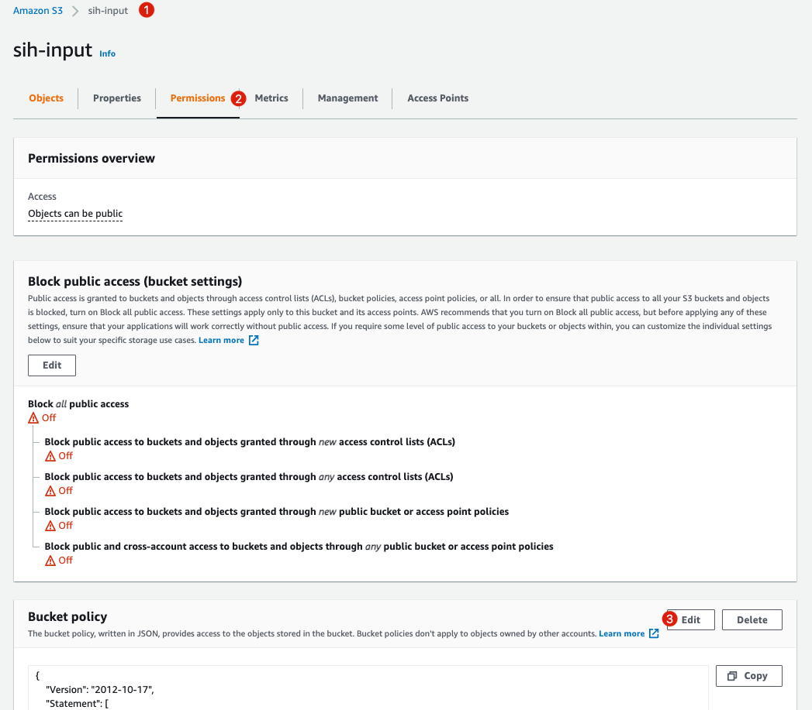
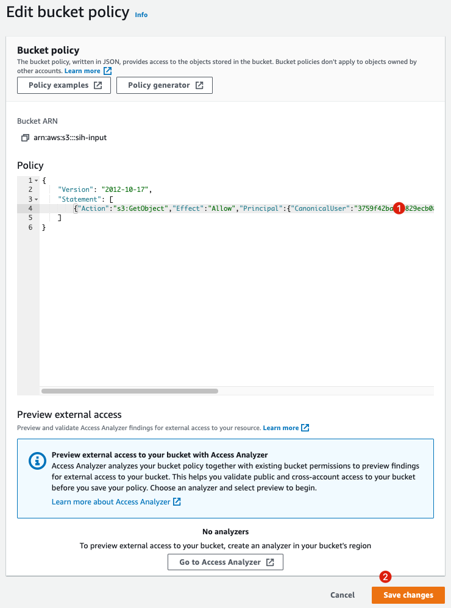

# Table of Contents

- [Table of Contents](#table-of-contents)
- [Overview](#overview)
  - [Lambda Image Handler](#lambda-image-handler)
    - [架构流程](#架构流程)
    - [前提条件（国际区域）](#前提条件国际区域)
    - [部署参数（国际区域）](#部署参数国际区域)
    - [部署后续（国际区域）](#部署后续国际区域)
    - [修改存储桶策略 BucketPolicy（国际区域）](#修改存储桶策略-bucketpolicy国际区域)
  - [ECS Image Handler](#ecs-image-handler)
    - [Workflow](#workflow)
    - [Prerequisites](#prerequisites)
    - [How to use?](#how-to-use)
    - [Load Test](#load-test)
    - [Troubleshooting](#troubleshooting)

# Overview

This cdk construct includes two different implementations of serverless image handler:

1. Lambda Image Handler
2. ECS Image Handler

## Lambda Image Handler


这是一个基于 Lambda 的无服务器图像处理器版本.

1. 输出的修改后图片必须小于 6MB。
2. `x-oss-process`语法。

### 架构流程

1. 客户端图像修改请求首先发送至 CloudFront。
2. 如果请求没有被 CloudFront 缓存，它将首先通过 API Gateway 发送到后端 Lambda。(即 Origin #1)
3. Lambda 将从 S3 获取图片，并做一些图片处理。
4. 如果客户端请求不需要任何修改或请求原点图片。CloudFront 将首先把请求发送到 Origin #1。但是，Origin #1 会直接返回 HTTP 403 Forbidden，这就告诉 CloudFront 去访问 #2。这个设计的目的是告诉 CloudFront 直接访问存储在S3中的图片。

### 前提条件（国际区域）

1. 一个或多个 S3 桶

### 部署参数（国际区域）

| 参数名称     | 描述                  |
| ------------ | --------------------- |
| BucketParam0 | S3 存储桶 #0          |
| BucketParam1 | S3 存储桶 #1 （可选） |
| BucketParam2 | S3 存储桶 #2 （可选） |

### 部署后续（国际区域）

| 输出参数                             | 描述                                                                                                                                                            | 示例                                                                                                                      |
| ------------------------------------ | --------------------------------------------------------------------------------------------------------------------------------------------------------------- | ------------------------------------------------------------------------------------------------------------------------- |
| ApiGw2Endpoint                       | API Gateway 的 API 地址（无缓存）                                                                                                                               | https://`<ID>`.execute-api.`<REGION>`.amazonaws.com                                                                       |
| Bucket0                              | S3 存储桶 #0 名称                                                                                                                                               | s3://`<BUCKET0>`                                                                                                          |
| BucketPolicy0                        | S3 存储桶 #0 的桶策略 ⚠️ 注意：部署好之后还需要在您的“存储桶 #0”的存储桶策略内将此内容复制到存储桶策略内。此策略为 CloudFront 安全访问“存储桶 #0” 必须填写的策略 | {"Action":"s3:GetObject","Effect":"Allow","Principal":{"CanonicalUser":"`<ID>`"},"Resource":"arn:aws:s3:::`<BUCKET0>`/*"} |
| DistUrl0                             | CloudFront 的 API 地址（有缓存，推荐作为生产环境 API 地址）                                                                                                     | https://`<ID>`.cloudfront.net                                                                                             |
| Bucket1（若存在 BucketParam1）       | 同上                                                                                                                                                            | 同上                                                                                                                      |
| BucketPolicy1（若存在 BucketParam1） | 同上                                                                                                                                                            | 同上                                                                                                                      |
| DistUrl1（若存在 BucketParam1）      | 同上                                                                                                                                                            | 同上                                                                                                                      |
| Bucket2（若存在 BucketParam2）       | 同上                                                                                                                                                            | 同上                                                                                                                      |
| BucketPolicy2（若存在 BucketParam2） | 同上                                                                                                                                                            | 同上                                                                                                                      |
| DistUrl2（若存在 BucketParam2）      | 同上                                                                                                                                                            | 同上                                                                                                                      |
| StyleConfig                          | 处理样式的 DynamoDB 配置表名称                                                                                                                                  |                                                                                                                           |

使用方式：

```
curl <DistUrl0>/example.jpg?x-oss-process=image/resize,w_200,h_100/quality,q_50
```

### 修改存储桶策略 BucketPolicy（国际区域）



1. 找到 S3 存储桶 #0。
2. 找到权限 Permissions 选项卡。
3. 找到存储桶策略 Bucket Policy， 点击 Edit 按钮。



将输出参数 BucketPolicy0 的内容复制到此处，并保存。格式如图。例如：

```json
{
    "Version": "2012-10-17",
    "Statement": [
        {"Action":"s3:GetObject","Effect":"Allow","Principal":{"CanonicalUser":"<ID>"},"Resource":"arn:aws:s3:::<BUCKET0>/*"}
    ]
}
```


## ECS Image Handler


This is an ECS Fargate based version of serverless image handler. The key features are:

1. Support output payload size exceed 6MB.
2. `x-oss-process` syntax.
3. Modular function design.

### Workflow

1. An image modification request will be sent through CloudFront.
2. If the request is not cached by CloudFront it will firstly be sent to backend ECS Fargate cluster over Application Load Balancer. (i.e. origin #1)
3. The ECS Fargate service will get pictures from S3 and do some modification based on the request return back to the CloudFront.
4. If the request doesn't need any modification or request origin pictures. CloudFront will firstly send the request to origin #1. But the origin #1 will just return HTTP 403 Forbidden which's telling the CloudFront to failback to origin #2. This an intended design to tell CloudFront to directly access the picture stored in S3 without through ECS cluster.

### Prerequisites

1. [nodejs](https://nodejs.org/) >= 12.0.0
2. [docker](https://www.docker.com/)
3. [yarn](https://yarnpkg.com/getting-started/install)
4. [aws-cdk](https://docs.aws.amazon.com/cdk/latest/guide/getting_started.html)
5. [cdk bootstrap](https://docs.aws.amazon.com/cdk/latest/guide/cli.html#cli-bootstrap)

### How to use?

```bash
cd source/constructs
# Install dependencies
yarn
# Run test
yarn test

# Deploy stack
CDK_DEPLOY_REGION=us-west-2 yarn deploy serverless-ecs-image-handler-stack

# Or deploy stack to an existing vpc
CDK_DEPLOY_REGION=us-west-2 yarn deploy serverless-ecs-image-handler-stack -c use_vpc_id=vpc-123124124124

# Or deploy stack with an existing s3 bucket (WARN: This may overide your existing bucket policy)
CDK_DEPLOY_REGION=us-west-2 yarn deploy serverless-ecs-image-handler-stack -c use_vpc_id=vpc-123124124124 -c use_bucket=your-bucket

# Destroy stack if you need
yarn destroy serverless-ecs-image-handler-stack
```

Once it is deployed you will get:

```
 ✅  serverless-ecs-image-handler-stack

Outputs:
serverless-ecs-image-handler-stack.serverlessecrimagehandlerstackCFDistributionUrl1454FE90 = https://ABCDEFGH.cloudfront.net
serverless-ecs-image-handler-stack.serverlessecrimagehandlerstackServiceLoadBalancerDNSDB026A6D = serve-serve-ABCDEF.us-west-2.elb.amazonaws.com
serverless-ecs-image-handler-stack.serverlessecrimagehandlerstackServiceServiceURLE05B511A = http://serve-serve-ABCDEF.us-west-2.elb.amazonaws.com
serverless-ecs-image-handler-stack.serverlessecrimagehandlerstackSrcBucketS3Url593801C5 = s3://serverless-ecr-image-han-serverlessecrimagehandle-ABCDE

Stack ARN:
arn:aws:cloudformation:us-west-2:000000000:stack/serverless-ecs-image-handler-stack/0000000-0000-0000-0000-0000
✨  Done in 593.00s.
```

Upload some pictures into

```
serverlessecrimagehandlerstackSrcBucketS3Url593801C5 = s3://serverless-ecr-image-han-serverlessecrimagehandle-ABCDE
```

Then you could try to open

```
serverlessecrimagehandlerstackCFDistributionUrl1454FE90 = https://ABCDEFGH.cloudfront.net
```

Like: https://ABCDEFG.cloudfront.net/example.jpg?x-oss-process=image/resize,w_500,h_500,limit_0/quality,q_50

### Load Test

Just simply test against ALB endpoint.

```shell
$ npx loadtest -t 900 -c 20 --rps 300 "http://serve-serve-ABCDEF.us-west-2.elb.amazonaws.com/example.jpg?x-oss-process=image/resize,w_200,h_100,limit_1/quality,q_50" | log.log

[Fri Jul 23 2021 13:02:23 GMT+0000 (Coordinated Universal Time)] INFO Target URL:          http://serve-serve-ABCDEF.us-west-2.elb.amazonaws.com/example.jpg/example.jpg?x-oss-process=image/resize,w_200,h_100,limit_1/quality,q_50
[Fri Jul 23 2021 13:02:23 GMT+0000 (Coordinated Universal Time)] INFO Max time (s):        900
[Fri Jul 23 2021 13:02:23 GMT+0000 (Coordinated Universal Time)] INFO Concurrency level:   20
[Fri Jul 23 2021 13:02:23 GMT+0000 (Coordinated Universal Time)] INFO Agent:               none
[Fri Jul 23 2021 13:02:23 GMT+0000 (Coordinated Universal Time)] INFO Requests per second: 300
[Fri Jul 23 2021 13:02:23 GMT+0000 (Coordinated Universal Time)] INFO 
[Fri Jul 23 2021 13:02:23 GMT+0000 (Coordinated Universal Time)] INFO Completed requests:  269848
[Fri Jul 23 2021 13:02:23 GMT+0000 (Coordinated Universal Time)] INFO Total errors:        0
[Fri Jul 23 2021 13:02:23 GMT+0000 (Coordinated Universal Time)] INFO Total time:          900.0039508269999 s
[Fri Jul 23 2021 13:02:23 GMT+0000 (Coordinated Universal Time)] INFO Requests per second: 300
[Fri Jul 23 2021 13:02:23 GMT+0000 (Coordinated Universal Time)] INFO Mean latency:        46.4 ms
[Fri Jul 23 2021 13:02:23 GMT+0000 (Coordinated Universal Time)] INFO 
[Fri Jul 23 2021 13:02:23 GMT+0000 (Coordinated Universal Time)] INFO Percentage of the requests served within a certain time
[Fri Jul 23 2021 13:02:23 GMT+0000 (Coordinated Universal Time)] INFO   50%      38 ms
[Fri Jul 23 2021 13:02:23 GMT+0000 (Coordinated Universal Time)] INFO   90%      55 ms
[Fri Jul 23 2021 13:02:23 GMT+0000 (Coordinated Universal Time)] INFO   95%      64 ms
[Fri Jul 23 2021 13:02:23 GMT+0000 (Coordinated Universal Time)] INFO   99%      132 ms
[Fri Jul 23 2021 13:02:23 GMT+0000 (Coordinated Universal Time)] INFO  100%      2578 ms (longest request)
```

### Troubleshooting

1. Internal error reported from downstream service during operation 'AWS::CloudFront::OriginRequestPolicy'.

    Check if you're deploying the stack to different region with the same stack name. Since `AWS::CloudFront::OriginRequestPolicy`
    must be unique. To solve this issue, try to deploy the stack with different stack name.

    ```
    STACK_NAME=ecs-img-hdlr yarn deploy serverless-ecs-image-handler-stack ...
    ```

2. ECS always stay in `CREATE_IN_PROGRESS` status. And ECS task failed with `ResourceInitializationError: unable to pull secrets or registry auth: pull command failed: : signal: killed`

    This is a known issue. To solve this. Please don't use default vpc. Let cdk create a new VPC for your.
